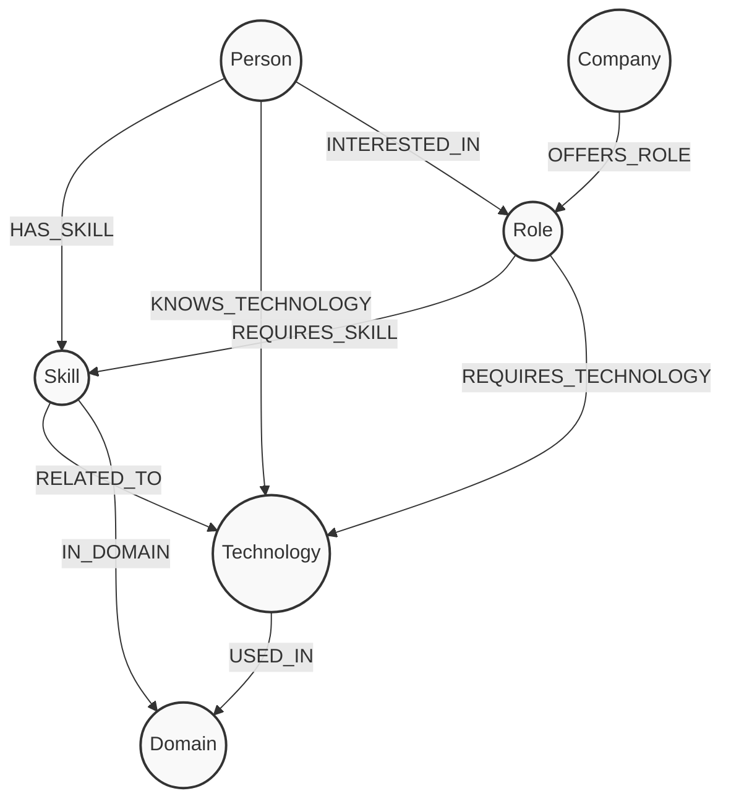

# SkillGraph

## Project Overview
SkillGraph is a developer skill and job exploration platform built on top of CognoDB, a graph database. 
It allows users to explore developers, skills, and open jobs via a graph structure, demonstrating advanced graph traversal recommendations. The frontend is a polished, professional React application that provides a responsive and intuitive interface for navigating these connections.

## Live Demo
- Frontend (live app): https://wexa-skillgraph-frontend.onrender.com
- Backend (API health check): https://wexa-skillgraph-backend.onrender.com/api/health

*This app is hosted on Render's free tier. If the backend has been inactive, the first request may take up to 50 seconds to respond while the service wakes up. Subsequent requests will be fast.*

## Architecture
- **Backend:** Java 21, Spring Boot 3.x, REST APIs.
- **Database:** CognoDB (Neo4j compatible) via Official Neo4j Java Driver (Bolt protocol).
- **Frontend:** React 19, Vite, Tailwind CSS v4, React Router DOM, Lucide React.
- **Communication:** The frontend communicates with the backend via standard REST APIs. No graph querying happens on the client side.

## Why a Graph Database?
Relational databases are excellent for structured data where relationships are mostly static (e.g., foreign keys linking a person to an address). However, SkillGraph answers complex, highly connected questions: *“Which companies are hiring for roles that require skills Alice possesses, and what technologies do those roles use?”*

In a traditional relational model, answering this requires many expensive SQL `JOIN` operations across sparse junction tables (e.g., `person_skills`, `role_skills`, `company_roles`), degrading performance and making queries incredibly difficult to read and maintain. 

A graph database like CognoDB stores the **relationships** as first-class citizens. Multi-hop traversal (e.g., `Person -> HAS_SKILL -> Skill <- REQUIRES_SKILL <- Role`) is naturally expressed and highly performant, exploring only the relevant sub-graph rather than computing Cartesian products across the entire database.

## Graph Model
SkillGraph utilizes a property graph to model the relationships between professionals, skills, technologies, roles, domains, and companies.

### Graph Architecture Diagram


### Verified Dataset
The current verified graph database state consists of:
- **38 Nodes** (across People, Skills, Technologies, Roles, Companies, Domains)
- **68 Relationships** (HAS_SKILL, KNOWS_TECHNOLOGY, INTERESTED_IN, RELATED_TO, IN_DOMAIN, USED_IN, REQUIRES_SKILL, REQUIRES_TECHNOLOGY, OFFERS_ROLE)

*(Do not modify this base dataset or schema without consulting the project requirements)*

## Backend Setup

### Environment Variables
The backend requires the following environment variables to connect to CognoDB:
- `COGNO_DB_URI` (e.g., `bolt://localhost:7687`)
- `COGNO_DB_USER`
- `COGNO_DB_PASSWORD`

*(Never place actual credentials in this README or any committed files)*

### Starting the Backend
From the `backend` directory, run:
```bash
mvn spring-boot:run
```
The backend runs on port `8080` by default.

### Health Endpoints
- `GET /api/health` : Basic API health check.
- `GET /api/health/db` : Validates CognoDB connection.
- `GET /api/graph/verify` : Validates database nodes and relationships.

## Frontend Setup

### Environment Variables
The frontend communicates with the backend via the `VITE_API_BASE_URL` environment variable. By default, it expects the Spring Boot backend to be running at `http://localhost:8080/api`.
Ensure that `frontend/.env` is configured properly:
```env
VITE_API_BASE_URL=http://localhost:8080/api
```
If you don't have a `.env` file, copy `.env.example` to `.env`.

### Starting the Frontend
From the `frontend` directory, install dependencies and start the development server:
```bash
npm install
npm run dev
```

To build for production:
```bash
npm run build
```

## Security
- **No Direct Database Access:** The React frontend never connects to CognoDB directly. All graph traversals are handled securely by the backend via REST endpoints.
- **Credential Protection:** Database credentials remain strictly on the server-side environment and are not exposed to the client or checked into version control. Local `.env` files containing secrets are ignored via `.gitignore`.

## Frontend Routes & API Endpoints

### Frontend Routes
- `/` : Dashboard metrics.
- `/people` : Directory of professionals.
- `/people/:id` : Person detail showing skills, technologies, and **Graph-Based Career Recommendations**.
- `/skills` : Directory of skills.
- `/technologies` : Directory of technologies.
- `/roles` : Directory of open roles.
- `/roles/:id` : Role details showing skill and technology requirements.
- `/companies` : Directory of companies.
- `/companies/:id` : Company details showing all roles offered.
- `/domains` : Directory of industry domains.
- `/domains/:id` : Domain details showing skills and technologies grouped under it.
- `/search?q={query}` : Global search parsing across all nodes.

### Backend API Endpoints (Prefixed with `http://localhost:8080/api`)
- `GET /people`, `GET /people/{id}`
- `GET /skills`
- `GET /technologies`
- `GET /roles`, `GET /roles/{id}/requirements`
- `GET /companies`, `GET /companies/{id}/roles`
- `GET /domains`, `GET /domains/{id}`
- `GET /search?q={query}`

### Graph Recommendations Note
The endpoint `GET /api/graph/recommendations/{personId}` currently returns a flat list of matching roles and companies based on a person's skills. It does not return the exact overlapping relationships (i.e., *which* specific skills triggered the match). The frontend UI reflects this limitation. To provide richer explanations in the future, the backend API contract would need to be updated to return relationship details.

## Application UI Screenshots
*(Note: To fulfill the WEXA assignment deliverables, please capture screenshots of your local running instance and save them to `docs/screenshots/` before submitting).*
- `docs/screenshots/dashboard.png` - Showing the system overview metrics.
- `docs/screenshots/person_detail.png` - Showing the skills and technologies of a developer.
- `docs/screenshots/recommendation.png` - Highlighting the graph-based career recommendations.
- `docs/screenshots/search.png` - Demonstrating global graph search functionality.

## Screen Recording Demonstration Guide

### Demo Video

[Watch the WEXA SkillGraph Demo](https://drive.google.com/file/d/1rvAiCc6HuYECWe70o1d0oel5dHzSS-VH/view?usp=sharing) *(Recorded against the live hosted deployment)*

For the requested assignment screen recording, we recommend the following flow:
1. **Start** on the Dashboard to prove the application is running and the database is seeded.
2. Navigate to **People** and select a person (e.g., Alice).
3. Scroll to the **Career Recommendations** section.
4. **Explain the Graph traversal:** Explain that these recommendations are generated via a multi-hop Cypher query (`Person -> HAS_SKILL -> Skill <- REQUIRES_SKILL <- Role <- OFFERS_ROLE <- Company`), which would be extremely complex in a relational database but is trivial and fast in CognoDB.
5. Demonstrate the **Global Search** feature to show how all nodes in the graph are indexed.

## Deployment & Hosting Preparation
The architecture of SkillGraph is completely decoupled and production-ready:
1. **Frontend Hosting (e.g., Vercel, Netlify):** Deploy the Vite bundle. Set `VITE_API_BASE_URL` to your production backend URL.
2. **Backend Hosting (e.g., Railway, Heroku, AWS):** Deploy the Spring Boot `.jar`. Ensure CORS is configured for your frontend origin.
3. **Database (e.g., Neo4j Aura, CognoDB Managed):** Provide the managed `COGNO_DB_URI`, `COGNO_DB_USER`, and `COGNO_DB_PASSWORD` securely to the backend container as environment variables.

## Troubleshooting
- **API Error / Failed to Fetch**: Ensure the Spring Boot backend is running locally on port 8080 and that you have exported `COGNO_DB_URI`, `COGNO_DB_USER`, and `COGNO_DB_PASSWORD` before starting the backend.
- **Missing Graph Data**: If you encounter an empty graph, you may need to seed the database (only if the environment is fresh): `curl -X POST http://localhost:8080/api/graph/seed`.
